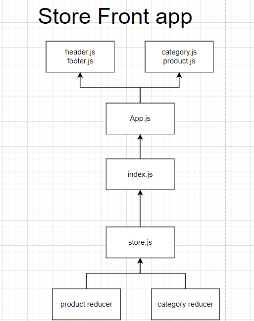

# LAB - 36: storefront
An e-Commerce storefront using React with Redux, coupled with  live API server

# Deployment Test
* Author: Boshra Jaber
* Deployer [Link](https://60aa7a486ea1b180b3055da9--storefront401.netlify.app/)
* Setup: 
  - To create a react app: `npx create-react-app app-name`
  - another way by adding npm flag: `npx create-react-app app-name --use-npm`
  - Remove the .git file so you don't have nested repo: `rm -rf .git`
  - To start the app: `npm start`
  - To use condition: `npm i react-if`
  - To use Redux: `npm i react-redux redux redux-devtools-extension`
  - Install Material UI: `npm install @material-ui/core`, `npm install @material-ui/icons`.

## UML

