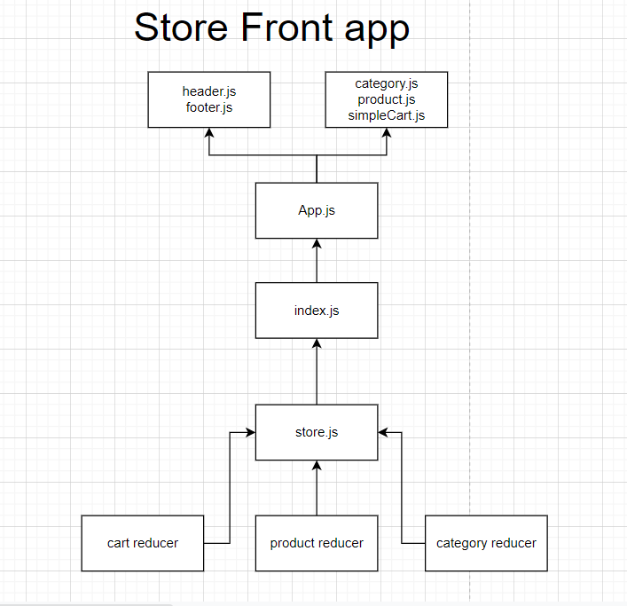

# LAB - 36: storefront
An e-Commerce storefront using React with Redux, coupled with  live API server

# Deployment Test
* Author: Boshra Jaber
* Deployer [Link](https://60ad75e9d9b6a9008eaf715f--storefront401.netlify.app/)
* Setup: 
  - To create a react app: `npx create-react-app app-name`
  - another way by adding npm flag: `npx create-react-app app-name --use-npm`
  - Remove the .git file so you don't have nested repo: `rm -rf .git`
  - To start the app: `npm start`
  - To use condition: `npm i react-if`
  - To use Redux: `npm i react-redux redux redux-devtools-extension`
  - Install Material UI: `npm install @material-ui/core`, `npm install @material-ui/icons`.

# User Stories:
* As a user, I expect to see a list of available product categories in the store so that I can easily browse products
* As a user, I want to choose a category and see a list of all available products matching that category
* As a user, I want a clean, easy to use user interface so that I can shop the online store with confidence
* As a user, I want to choose from products in the list and add them to my shopping cart
* As a user, I want to see the products that I’ve added to my shopping cart so that
* As a user, I want to change the quantity of items I intend to purchase in my shopping cart
* As a user, I want to be able to remove an item from my shopping cart

## UML

